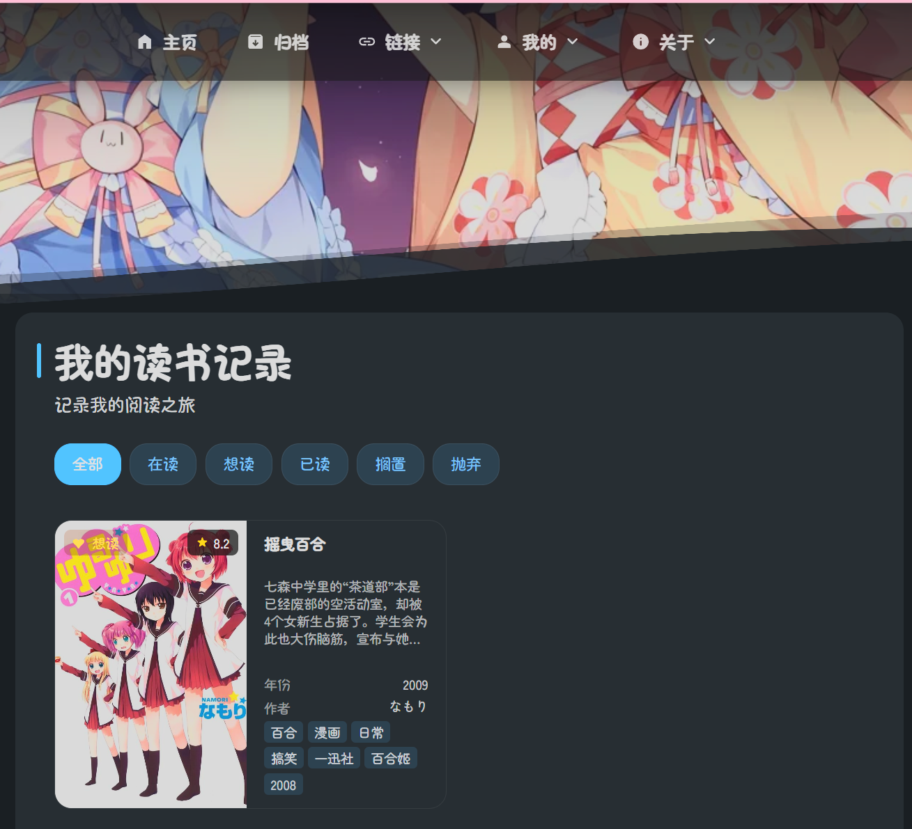
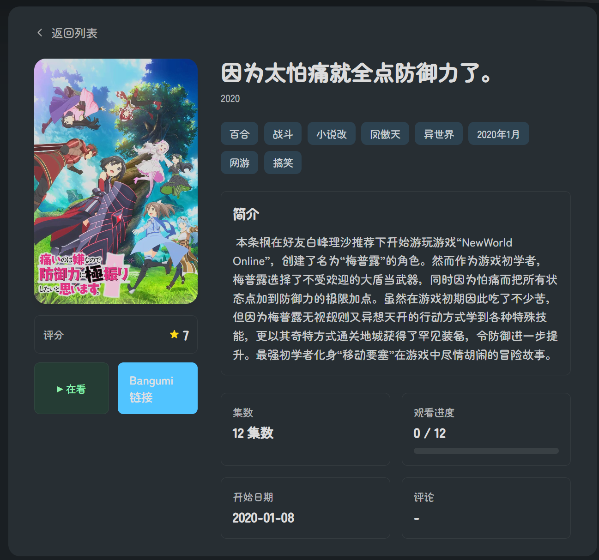

# DaydreamBlog

This is Daydream's blog.

Based on the original [Mizuki](https://github.com/matsuzaka-yuki/Mizuki) template

## New features

### Book UI aligned with anime UI

- Based on the original anime page framework, I have added a new book page with exactly the same structure and style as the anime page.
- The data is also fetched from the Bangumi API using the same method as the anime data.

### secondary menu on the anime page

- To better display details about the works, I have added a secondary menu to show information such as the synopsis, total episode count, etc. The Bangumi link is also placed here.

## License & Attribution

This project is developed based on the secondary development of [Mizuki](https://github.com/matsuzaka-yuki/Mizuki) and abides by the open source licenses of the original project:

- Apache License 2.0
  http://www.apache.org/licenses/LICENSE-2.0
- MIT License
  https://opensource.org/licenses/MIT
